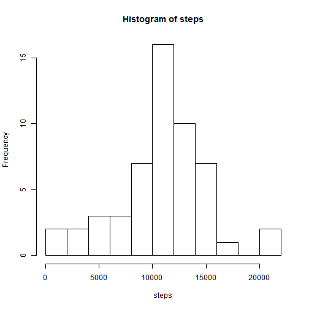
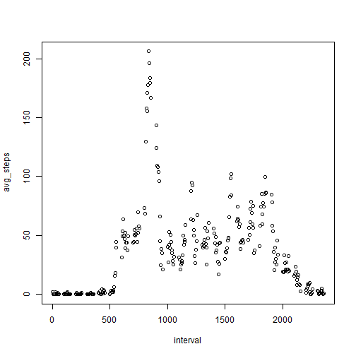
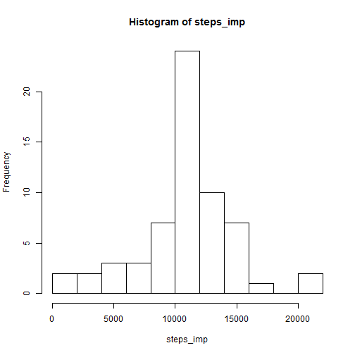
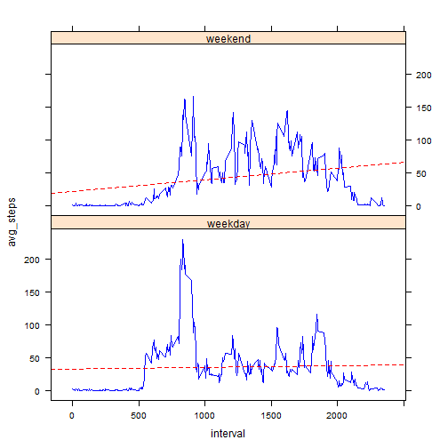

Reproducible Research: Peer Asssignment 1
========================================================

## Loading the Data from a Zipped File

Create path to the data file downloaded from the course web site.

```r
filepath <- paste(getwd(), "activity.zip", sep="/")
```

Get the name of the file in the .zip archive.

```r
fname <- unzip(filepath, list=TRUE)$Name
```

Unzip the file to the name retrieved from the archive.

```r
unzip(filepath, files=fname)
```

Read the data from the file into a data frame.

```r
data <- read.csv(paste(getwd(), fname, sep="/"))
```

## Preprocessing the Data 

Change the date format from factor to date.


```r
data$date <- as.Date(data$date, format = "%Y-%m-%d")
```

Create a subset called 'bestdata' consisting of the rows with no missing data.

```r
bestdata <- data[!is.na(data$steps), ]
```

## Mean and Median Steps Taken Per Day

Using the 'bestdata' subset, we add up, for each date, the number of steps taken across all time intervals.

```r
totals <- aggregate(bestdata[,1], by = list(date = bestdata$date), sum)
```

The following is a histogram of the number of steps taken per day.

```r
steps <- totals[,2]
hist(steps, breaks=10)
```

 

To calculate the mean and median number of steps taken per day:

```r
avg <- format(round(mean(steps)), scientific=FALSE)
med <- format(round(median(steps)), scientific=FALSE)
```
The average number of steps taken is 10766.

The median number of steps taken is 10765.

## Daily Activity Pattern

Here we aggregate the number of steps taken over intervals:

```r
pattern <- aggregate(bestdata[,1], by = list(interval=bestdata$interval), mean)
names(pattern) <- c("interval", "avg_steps")
with(pattern, plot(interval, avg_steps))
```

 

To find the interval with the maximum number of average steps:

```r
bestrow <- pattern[which.max(pattern[, 2]), ]
top_interval <- round(bestrow$interval)
top_steps <- round(bestrow$avg_steps)
```

The interval with the maximum number of average steps is number 835, with an average of 206 steps.

## Imputing Missing Values

To calculate the total number of missing values in the dataset:


```r
missing <- data[is.na(data$steps), ]
mcount <- nrow(missing)
```
The total number of rows with missing data is 2304.

The following function, 'impute', takes a data frame as input. It imputes missing values in one column (target_col), based on applying a function (fxn) to values in another column (basis_col). We precompute a dictionary of values for missing items, then replace the missing items in the original dataset.


```r
impute <- function (data, target_col, basis_col, fxn)
{
  # =========================================================
  # STEP 1: Create a data frame to precompute missing values.
  # =========================================================
  
  # Make a copy of the data for use by this function.
  df <- data
  
  # Create a version of the data set with no missing values.
  df_good <- df[!is.na(df[, target_col]), ]
    
  # Create a precomputed dictionary to map 
  #   values of basis column to an imputed value,
  #   using function fxn.
  dict <- aggregate(df_good[, target_col], by = list(df_good[, basis_col]), fxn)
  
  # =========================================================
  # STEP 2: Replace missing values in the target column
  #   by looking up values in the precomputed dictionary.
  # =========================================================
  
  # find row numbers for rows with missing data
  badrows <- which(is.na(df[, target_col]))
  
  for (item in badrows)
  {
    # find value in the basis column corresponding to 
    #   the missing item.
    my_basis <- df[item, basis_col]
    # find the value in the dictionary corresponding to
    #   the basis value for the missing item.
    new_value <- dict[dict[,1] == my_basis, 2]
    # Replace the missing value with the new precomputed value.
    df[item, target_col] <- new_value
  }
  
  # Return the data set with missing values replaced by
  #  imputed values.
  return(df)
}
```

## Analysis of Dataset with Imputed Missing Values

The following steps create a new data set with imputed missing values:


```r
newdata <- impute(data, 1, 3, "mean")
```

Using the dataset with imputed missing values, we add up, for each date, the number of steps taken across all time intervals.

```r
totals_imp <- aggregate(newdata[,1], by = list(date = newdata$date), sum)
```

The following is a histogram of the number of steps taken per day.

```r
steps_imp <- totals_imp[,2]
hist(steps_imp, breaks=10)
```

 

To calculate the mean and median number of steps taken per day:

```r
avg_imp <- format(round(mean(steps_imp)), scientific=FALSE)
med_imp <- format(round(median(steps_imp)), scientific=FALSE)
```
The average number of steps taken is 10766.

The median number of steps taken is 10766.

Conclusion: After imputing missing values, the values calculated for average and mean steps remains essentially unchanged. The rounded value for the average remains the same, and the value for the median increased from 10765 to 10766. For this example, imputation allows us to perform our analysis using the entire dataset. The analysis results is essentially the same as the results generated by dropping the cases that have missing data.

## Comparing Activity Patterns on Weekdays and Weekends

Here we create a new factor variable, dtype, with two levels, "weekday" and "weekend," indicating whether the date of data collection is a weekday or a weekend day.


```r
dtype <- sapply(newdata$date, function(x) {
  if (weekdays(x) == "Sunday" | weekdays(x) == "Saturday")
    return("weekend")
  else
    return("weekday")
})

dtype <- as.factor(dtype)
newdata <- cbind.data.frame(newdata, dtype)
```

The following is a time series panel plot of the 5-minute intervals (x-axis) and the average number of steps taken, averaged across weekdays and weekend days (y-axis). The red dashed line in each panel plots the regression line for the mean number of steps taken.


```r
library(lattice)
```

```
## Warning: package 'lattice' was built under R version 3.0.3
```

```r
# Create a new data frame that calculates the average steps
#  for each interval, for each dtype.

ww <- aggregate(newdata[,1], by=list(i=newdata$i, dtype=newdata$dtype), mean)
names(ww) <- c("interval", "dtype", "avg_steps")

# Create the panel plot.

xyplot(avg_steps ~ interval | dtype, data=ww, layout=c(1,2), panel = function(x,y, col, type){
  panel.xyplot(x, y, col='blue', type="l")
  panel.abline(lm(y~x),col = 'red', lty="dashed")
})
```

 

The two plots suggest that the average number of steps taken increases very slightly over the course of the day on weekdays, but increases at a higher rate over the course of the day on weekend days.
